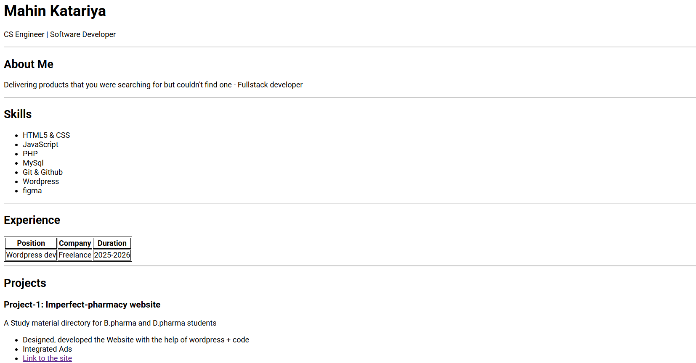
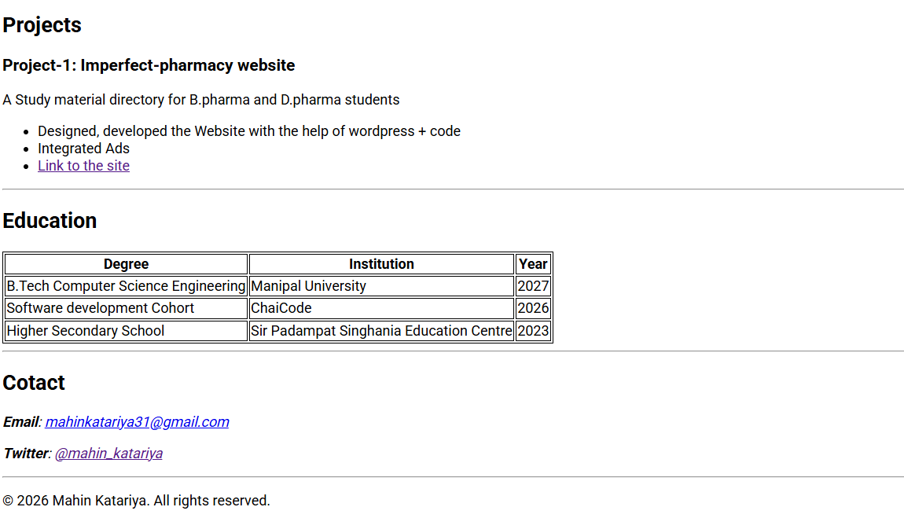

# Portfolio

> My Portfolio Site, made just with HTML currently.

 ## Screenshots




## Link for the page -
[Project Link](https://maahin.vercel.app)


## Setup & Installation

Since this portfolio is a standalone HTML file, there are no complex dependencies or build steps.

### Option 1: Direct Download
1.  **Download** the `index.html` file from this repository.
2.  **Double-click** the file to open it in your default web browser (Chrome, Firefox, Safari, etc.).

### Option 2: Clone the Repository
If you have Git installed, you can clone the repository to your local machine:

```bash
git clone [https://github.com/your-username/your-repo-name.git]
cd your-repo-name


